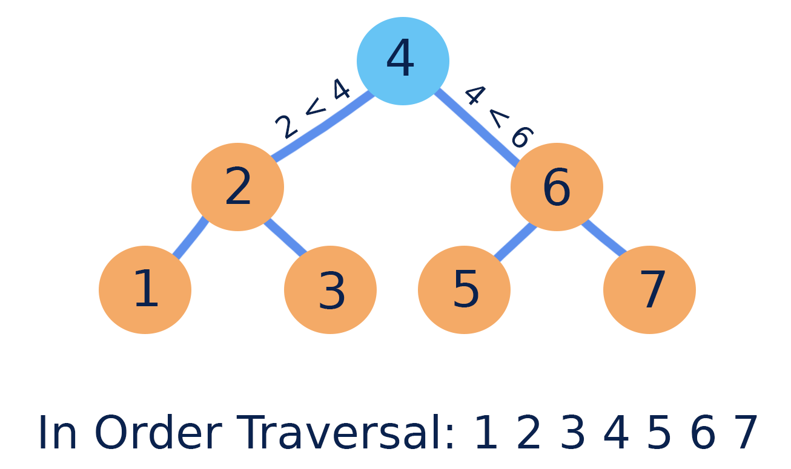
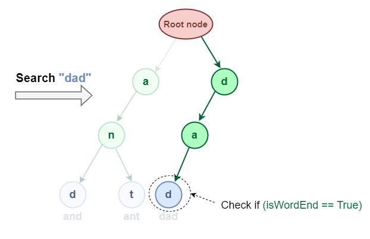

<h1> Hands-on Data Structure and Algorithmic Problem Solving</h1>
<h3> A 100% open source one-stop coding problem referring material! </a> <h3>
  DSA · Python · LeetCode · Principles · Problem patterns 

## Contributing
The material is written by Celia Lyu (celialyu1024@gmail.com) and Ricky Zhang (ruiqizhang8279@outlook.com). Feel free to send us email to contribute contents. Before you start to improve the contents, it would be helpful to know the [high-level structure of the material](#about-this-material).

All contributors (with decent amount of contributions) will be listed as authors in the project.

## About this material

In short, this material offers intermediate to advanced algorithm content, tailored to enhance the essential knowledge required for an engineer's role. The structure of the material: 
* **Data Structures**: These are the building blocks of our computational systems. Understanding them is vital as they lay the groundwork for more complex programming tasks, offering ways to organize, store, and access data efficiently.
* **Classical algorithms**: Our approach is about more than just understanding algorithms; it's about internalizing their core principles. By diving deep into a range of traditional problems, we build a reference database in our minds, allowing us to quickly draw parallels and solutions when faced with new challenges.

## Rationale behind this material

Navigating the intricacies of data structures and algorithms can be daunting, especially when applying them in real-world engineering tasks. Yet, mastering them is essential for every engineer striving for excellence in their respective field.

At the core of computer science is a fusion of various disciplines. From enumerative combinatorics to linear algebra in computer vision, the essence lies in the application of these principles to solve genuine challenges. What drives progress in this field is not just rote learning, but a genuine passion for understanding and implementing these principles.

While numerous resources delve into algorithmic theories (Introduction to Algorithms, Algorithmic Problem Solving, and so on) or exclusively focus on interview preparation (Cracking the Coding Interview, Coding Interview Questions, etc.), there's a noticeable gap. Few materials bridge the foundational knowledge with its practical, on-the-job application. This material is designed to fill that void. It underscores principles, patterns, and real-world problem-solving, using algorithmic concepts.

It's essential to note that this material does NOT aim to be a shortcut for interview success or offer hiring insights. Instead, it seeks to illuminate the elegance of algorithmic problem-solving. It's about nurturing a deeper appreciation for software engineering, with interview-style questions serving merely as a practical framework to solidify our understanding.

## For Readers

We're in the process of crafting a book now, which is inspired by and expanding upon the core concepts presented in this material.

Stay tuned and consider following us for upcoming updates.

## Data Structure

### Array
A contiguous block of memory containing elements of the same type. Use an array when you have a fixed number of items and you want quick access to each item based on its position, like books on a numbered shelf. 

  

**Simple Example**

Think of a shelf in a bookstore. The shelf has specific spots for books, numbered from 1 to 100. If you know the number, you can directly reach out and grab the book from its exact location without having to search.

### Linked List

Elements are stored in nodes, and each node points to the next node, forming a chain.

- **Singly Linked List**: Each node has data and a pointer to the next node.
- **Doubly Linked List**: Each node has data and two pointers, one pointing to the next node and another pointing to the previous node.
- **Circular Linked List**: The last node in the list points back to the first node.

  

**Simple Example**

Imagine a scavenger hunt game where each hint card has a clue to the location of the next card. The first card leads you to the second, the second leads to the third, and so on until you find the treasure.

### Stack

A last-in-first-out (LIFO) data structure. Operations mainly include push (to add) and pop (to remove). Use a stack when you want quick access to the most recent item, like a pile of plates.

  

**Simple Example**

Think of a stack of plates in a cafeteria. When a new plate is washed, it's placed on the top of the stack. When someone needs a plate, they take the one from the top, which is the last plate that was washed.

### Queue

A first-in-first-out (FIFO) data structure. Operations mainly include enqueue (to add) and dequeue (to remove). Use a queue when you need to maintain the order of arrival, like customers waiting in line.

  

**Simple Example**

Picture a line of people at a movie theater ticket counter. The first person in line will be the first to buy a ticket and leave the line, while others wait their turn.

### Tree

A hierarchical structure with a root and nodes connected by edges.

- **Binary Search Trees (BST)**:
    
    A binary tree with the property that all nodes in the left subtree have values less than the node and all nodes in the right subtree have values greater than the node. BSTs are particularly useful when you want to store data that you'll need to retrieve, insert, or delete quickly, while maintaining order.

    **Simple Example**
    
    Imagine you run a library. When a book is borrowed or returned, you need a quick way to update the list. Also, you often want to find books with titles "before" or "after" a given title in alphabetical order. A BST would be a good choice because it can keep the book titles in order while allowing for quick updates and lookups.

  

- **Tries (or Prefix Trees)**:
    
    A tree for storing a dynamic set of strings. They are commonly used in scenarios involving large datasets of strings.
    
    A Trie is a tree-like data structure used to store a dynamic set of strings. The key characteristic is that the position of a node in this tree defines the key with which that node is associated. As a result, strings with common prefixes share the same path until the point their prefixes diverge.

    **Simple Example**
    
    You're designing the search functionality for a dictionary app. When a user starts typing "choc", you want to immediately suggest words like "chocolate", "chock", and "chock-full". A trie can help you do this efficiently since it can quickly narrow down the list of words based on the typed prefix.

  

  

- **Heaps**:
    
    A tree-based data structure used primarily in algorithms like heap sort. Heaps are used when you need frequent access to the 'largest' or 'smallest' element, without the need to sort the entire set of data.

  
    
    **Simple Example**
    
    You run a music streaming service, and you want to always recommend the top 10 most listened to songs. As songs get played, their counts change. A heap can help you keep track of the top songs efficiently. When a song is played, you can quickly update its count and its position in the top songs without having to rearrange everything.
    
    - **Max Heap**: For any given node, its value is always greater than or equal to the values of its children. This means the highest value is at the root.
    - **Min Heap**: For any given node, its value is always less than or equal to the values of its children, keeping the smallest value at the root.

### Graph

### Matrix

### Hash Map / Hash Table

### Union Find

*Note: everything is still in progress, so use it with caution.*

## Algorithm

### Two Pointers

*Note: everything is still in progress, so use it with caution.*

## Referring Resources and Materials

Inspiration, code snippets, etc.
* [awesome-readme](https://github.com/matiassingers/awesome-readme)
* Skiena, Steven S. The algorithm design manual: Text. Vol. 1. Springer Science & Business Media, 1998.

## Feedback

If you have ideas to improve the book, about formatting, more contents, or correct the errors, do not hesitate to let me know.

To cite this content, please use:
