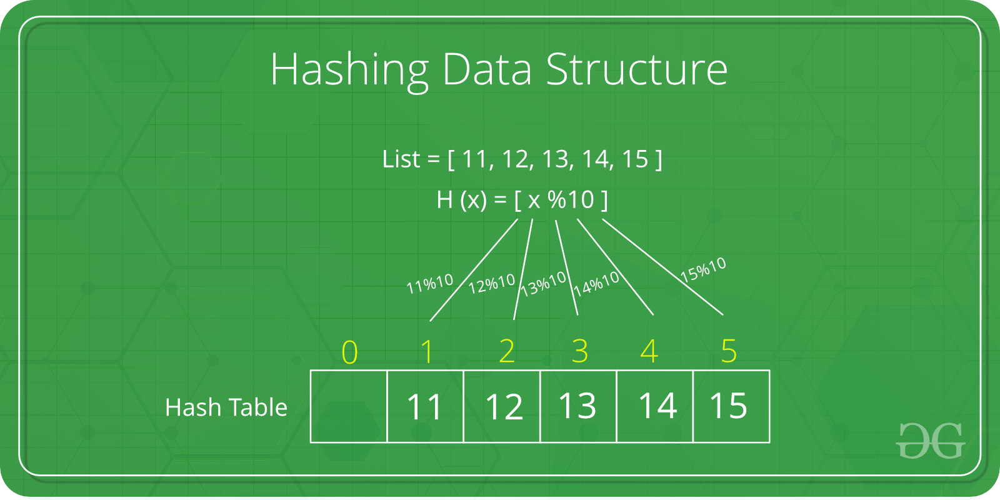
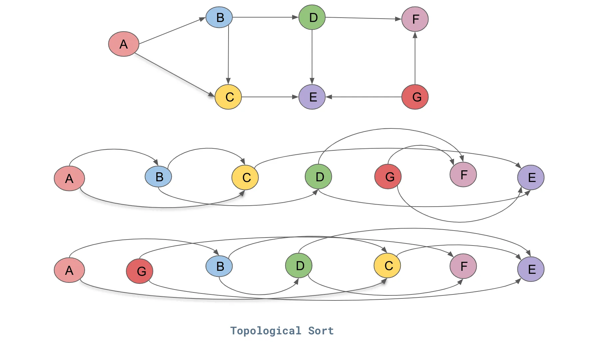
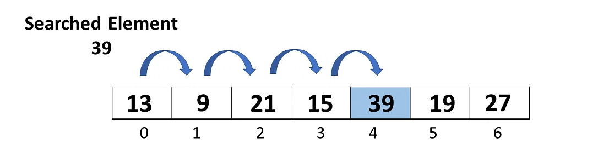

<div align="center">
<h1> Hands-on Data Structure and Algorithmic Problem Solving</h1>
<h3> A 100% open source one-stop coding problem referring material! </a> <h3>
<br> DSA · Python · LeetCode · Principles · Problem patterns<br>
</div>

<hr>

## Contributing
The material is written by Celia Lyu (celialyu1024@gmail.com) and Ricky Zhang (ruiqizhang8279@outlook.com). Feel free to send us email to contribute contents. Before you start to improve the contents, it would be helpful to know the [high-level structure of the material](#about-this-material).

All contributors (with decent amount of contributions) will be listed as authors in the project.

<hr>

## About this material

In short, this material offers intermediate to advanced algorithm content, tailored to enhance the essential knowledge required for an engineer's role. The structure of the material: 
* **Data Structures**: These are the building blocks of our computational systems. Understanding them is vital as they lay the groundwork for more complex programming tasks, offering ways to organize, store, and access data efficiently.
* **Classical algorithms**: Our approach is about more than just understanding algorithms; it's about internalizing their core principles. By diving deep into a range of traditional problems, we build a reference database in our minds, allowing us to quickly draw parallels and solutions when faced with new challenges.

<hr>

## Rationale behind this material

Navigating the intricacies of data structures and algorithms can be daunting, especially when applying them in real-world engineering tasks. Yet, mastering them is essential for every engineer striving for excellence in their respective field.

At the core of computer science is a fusion of various disciplines. From enumerative combinatorics to linear algebra in computer vision, the essence lies in the application of these principles to solve genuine challenges. What drives progress in this field is not just rote learning, but a genuine passion for understanding and implementing these principles.

While numerous resources delve into algorithmic theories (Introduction to Algorithms, Algorithmic Problem Solving, and so on) or exclusively focus on interview preparation (Cracking the Coding Interview, Coding Interview Questions, etc.), there's a noticeable gap. Few materials bridge the foundational knowledge with its practical, on-the-job application. This material is designed to fill that void. It underscores principles, patterns, and real-world problem-solving, using algorithmic concepts.

It's essential to note that this material does NOT aim to be a shortcut for interview success or offer hiring insights. Instead, it seeks to illuminate the elegance of algorithmic problem-solving. It's about nurturing a deeper appreciation for software engineering, with interview-style questions serving merely as a practical framework to solidify our understanding.

<hr>

## For Readers

We're in the process of crafting a book now, which is inspired by and expanding upon the core concepts presented in this material.

Stay tuned and consider following us for upcoming updates.

## Data Structure
<hr>

### Array
A contiguous block of memory containing elements of the same type. Use an array when you have a fixed number of items and you want quick access to each item based on its position, like books on a numbered shelf. 

<p align="center">
  
</p>

**Simple Example**

Think of a shelf in a bookstore. The shelf has specific spots for books, numbered from 1 to 100. If you know the number, you can directly reach out and grab the book from its exact location without having to search.

### Linked List

Elements are stored in nodes, and each node points to the next node, forming a chain.

- **Singly Linked List**: Each node has data and a pointer to the next node.
- **Doubly Linked List**: Each node has data and two pointers, one pointing to the next node and another pointing to the previous node.
- **Circular Linked List**: The last node in the list points back to the first node.

<p align="center">
  
</p>

**Simple Example**

Imagine a scavenger hunt game where each hint card has a clue to the location of the next card. The first card leads you to the second, the second leads to the third, and so on until you find the treasure.


### Stack

A last-in-first-out (LIFO) data structure. Operations mainly include push (to add) and pop (to remove). Use a stack when you want quick access to the most recent item, like a pile of plates.

<p align="center">
  
</p>

**Simple Example**

Think of a stack of plates in a cafeteria. When a new plate is washed, it's placed on the top of the stack. When someone needs a plate, they take the one from the top, which is the last plate that was washed.

### Queue

A first-in-first-out (FIFO) data structure. Operations mainly include enqueue (to add) and dequeue (to remove). Use a queue when you need to maintain the order of arrival, like customers waiting in line.

<p align="center">
  
</p>

**Simple Example**

Picture a line of people at a movie theater ticket counter. The first person in line will be the first to buy a ticket and leave the line, while others wait their turn.


### Tree

A hierarchical structure with a root and nodes connected by edges.

- **Binary Search Trees (BST)**:
    
    A binary tree with the property that all nodes in the left subtree have values less than the node and all nodes in the right subtree have values greater than the node. BSTs are particularly useful when you want to store data that you'll need to retrieve, insert, or delete quickly, while maintaining order.

    **Simple Example**
    
    Imagine you run a library. When a book is borrowed or returned, you need a quick way to update the list. Also, you often want to find books with titles "before" or "after" a given title in alphabetical order. A BST would be a good choice because it can keep the book titles in order while allowing for quick updates and lookups.

<p align="center">
  
</p>

- **Tries (or Prefix Trees)**:
    
    A tree for storing a dynamic set of strings. They are commonly used in scenarios involving large datasets of strings.
    
    A Trie is a tree-like data structure used to store a dynamic set of strings. The key characteristic is that the position of a node in this tree defines the key with which that node is associated. As a result, strings with common prefixes share the same path until the point their prefixes diverge.

    **Simple Example**
    
    You're designing the search functionality for a dictionary app. When a user starts typing "choc", you want to immediately suggest words like "chocolate", "chock", and "chock-full". A trie can help you do this efficiently since it can quickly narrow down the list of words based on the typed prefix.

  <p align="center">
  
</p>

- **Heaps**:
    
    A tree-based data structure used primarily in algorithms like heap sort. Heaps are used when you need frequent access to the 'largest' or 'smallest' element, without the need to sort the entire set of data.

    - **Max Heap**: For any given node, its value is always greater than or equal to the values of its children. This means the highest value is at the root.
    - **Min Heap**: For any given node, its value is always less than or equal to the values of its children, keeping the smallest value at the root.
      
    **Simple Example**
    
    You run a music streaming service, and you want to always recommend the top 10 most listened to songs. As songs get played, their counts change. A heap can help you keep track of the top songs efficiently. When a song is played, you can quickly update its count and its position in the top songs without having to rearrange everything.
 
    <p align="center">
  
</p>

### Graph

A set of nodes connected by edges. Can be directed (with arrows) or undirected.

**Simple Example**

Think of a social gathering where people are interacting with each other. You can use a graph data structure to keep track of who's talking to whom.

- **Adjacency Matrix**: A 2D array of size V x V where V is the number of vertices in a graph.

    <p align="center">
  
</p>
  
- **Adjacency List**: An array of lists. The size of the array is the number of vertices.

    <p align="center">
  
</p>

### Matrix

A matrix is like a table or grid with rows and columns, where each cell in the grid contains a piece of data. Think of it like an Excel spreadsheet, where you have rows (often represented by numbers) and columns (often represented by letters). The spot where a particular row and column intersect is a cell, and you can store information in it.

  <p align="center">
  
</p>

**Simple Example**
Imagine a big board, like a chessboard, but it can be as large as you want. Each individual square on this board is a place where you can write down a number or a piece of information. This entire board, with all its individual squares filled with data, is what we call a matrix in the world of computer science and mathematics.

### Hash Map / Hash Table

Used to store key-value pairs, allowing for quick storage and retrieval. They use a hash function to compute an index where an element will be stored. The real efficiency of a hash map comes from being able to quickly access the data you want without searching through everything.

**A Brief Introduction**

Imagine a massive room with many lockers. You have many books, each with a unique title, and you want a system that allows you to place each book in a specific locker so that whenever you need a particular book, you can find it instantly without checking every locker.

A "hash map" works in a similar fashion. It's like this room with lockers. The hash map takes the book title, processes it through a special function (called a "hash function"), and gives you a locker number. You then put the book in that locker or retrieve it from there when needed.

  <p align="center">
  
</p>

**Simple Example**

Let's say you have three books: "Harry Potter", "Moby Dick", and "Pride and Prejudice".

1. You want to store "Harry Potter". The hash function tells you to put it in locker #5.
2. Next, for "Moby Dick", the function points you to locker #23.
3. Lastly, "Pride and Prejudice" goes into locker #8.

Now, when you want to read "Moby Dick", instead of searching through every locker, the hash map directly tells you, "Look in locker #23!"

### Union Find

"Union Find" is a data structure used to keep track of disjoint sets (i.e., sets that have no element in common) and is particularly useful for certain problems that involve determining connected components in a network or ensuring the absence of cycles in a graph. 

It typically uses an array (or sometimes a tree structure) to represent each individual's group. Initially, each person is their own group. As people become acquainted, their group identities merge.

**Main Idea**

Union Find has two primary operations:

1. **Union**: When two individuals or groups decide to merge, you note down this merge event in the magical notebook. This is the "union" operation.
2. **Find**: If you ever want to check if two people are in the same group, you consult the notebook. This quick check is the "find" operation.

By repeatedly using these operations, you can determine which people are connected either directly (by shaking hands) or indirectly (knowing someone who knows someone).

  <p align="center">
  
</p>

**Simple Example**
Imagine a room full of people where everyone is standing alone, and no one knows anyone else. The objective is to form groups (or teams) and find out if two people belong to the same group.

"Union Find" is like a magical notebook that keeps track of these groups. Whenever two people decide to team up (or even if two teams decide to merge into a larger team), you make a note in this notebook. And when you're curious about whether two people are in the same team, you can quickly check the notebook to get your answer.

**Real-world Applications**

Consider, for example, a network of computers. If you want to see if two computers are connected directly or indirectly, the "Union Find" structure can help. It's like quickly checking if two computers belong to the same network cluster.

*Note: everything is still in progress, so use it with caution.*

<hr>


## Algorithm
<hr>

### Two Pointers

Think of "two pointers" as two bookmarks in a book. One bookmark starts at the beginning of the book, and the other at the end. They help you keep track of two locations simultaneously.

<p align="center">
  
</p>


**Basic Logic:**

Let's say you're trying to find two pages in the book that together tell a specific story or detail. To find them efficiently, you adjust the bookmarks. You might move the first bookmark a few pages forward and the second one a few pages backward, depending on the clues you find. The goal is to locate the right pages without flipping through the entire book one page at a time.

In essence, the "two-pointer" approach is like using dual bookmarks to smartly navigate a book, offering a blend of speed, simplicity, and adaptability.

**Typical questions that can be addressed using this approach:**

1. **Sum Questions**:
    - **Two Sum**: In a list of numbers, find any two numbers that add up to a given target. By having pointers at the start and end of a sorted list and moving them towards each other, you can efficiently find such pairs.
2. **Palindrome Check**:
    - Determine if a given string is a palindrome. By comparing characters from the start and end of the string, and moving inwards, you can check for palindrome properties.
3. **LinkedList Cycles**:
    - Determine if a sequence of items (like a chain of connected elements) has a loop in it. Using one pointer moving faster and one slower, if they ever meet, there's a loop.

### **Sorting**

Sorting is like organizing your books alphabetically on a shelf. It's easier to find a specific book quickly when they're in order, rather than if they were scattered randomly. Similarly, computers can process and find data more efficiently when it's sorted.

**Commonly used sorting algorithms:**

1. **Bubble Sort**:
    - Think of this as a process where numbers "bubble up" to their right positions. We go through the list from the beginning, comparing each pair of adjacent numbers. If they're in the wrong order, we swap them. We keep doing this until we don’t have to swap anymore. With each pass, the largest number gets "bubbled up" to its correct place at the end.
        
<p align="center">
  
</p>
        
2. **Selection Sort**:
    - This method involves scanning the list repeatedly to find the smallest element. On each pass, we select the smallest number from the unsorted section and swap it with the first unsorted number. As we proceed, the left side of the list becomes sorted, and we reduce the size of the unsorted section until the entire list is sorted.
        
<p align="center">
  
</p>
        
3. **Insertion Sort**:
    - Imagine you're building a sorted list one number at a time. You take one element from the unsorted section and move it back through the sorted section, inserting it in its proper place. You keep doing this for every number, making sure at every step that the left part of the list is always sorted.
        
<p align="center">
  
</p>
        
4. **Quick Sort**:
    - This is a divide-and-conquer approach. We select a 'pivot' number from the list and partition the other numbers into two groups - those less than the pivot and those greater. We then recursively apply the same process to the two groups. Over time, this process ensures every number finds its rightful position.
        
<p align="center">
  
</p>
        
5. **Merge Sort**:
    - Another divide-and-conquer method. We break the list down into two halves, sort each half independently, and then merge the sorted halves back together. If the halves are still large, we split them again, sort, and merge. This recursive breaking and merging ensures the list gets sorted.
        
<p align="center">
  
</p>
        
6. **Heap Sort**:
    - Here, we transform the list into a special tree structure called a heap. In this structure, parents are always larger than their children. Once the tree structure (or heap) is built, the largest element is at the top. We remove the top element, place it at the end of our list, and then rebuild the heap from the remaining elements. Repeating this process ensures our list gets sorted from largest to smallest.
        
<p align="center">
  
</p>
        
7. **Counting Sort**:
    - Imagine you're in a classroom and you want to know how many students got each possible score on a test. Instead of sorting the scores, you tally how many students received each score. Once you have the counts, you can easily construct a sorted list of scores. Counting Sort operates similarly: instead of comparing elements, it counts how many times each distinct value appears. It then uses those counts to place the values in their correct sorted position. It's most efficient when the range of possible input values (like test scores from 0-100) is not significantly larger than the number of values to be sorted.
        
<p align="center">
  
</p>
        
8. **Radix Sort**:
    - Think of sorting a list of numbers based on each digit, starting from the least significant (the rightmost) and moving to the most significant. It's like sorting library books by their call numbers, one digit at a time. If you were sorting numbers with up to three digits, you'd first group them by the units digit (0-9), then by the tens digit, and finally by the hundreds digit. By the time you've considered all digits, the numbers are sorted. Radix Sort uses this approach, usually in combination with another stable sorting method (like Counting Sort) to sort at each digit's level.
        
<p align="center">
  
</p>
        

**Data Structures for Sorting Problems**: Certain sorting problems might require specialized data structures or an understanding of a particular type of sort. These include:

- **Binary Heap**: Often used in Heap Sort and to implement priority queues.
- **Stacks and Queues**: Useful in problems that require a variation of sorting like Topological Sort.
- **Graph**: Directly related to Topological Sort, which is a linear ordering of vertices such that for every directed edge *uv*, vertex *u* comes before *v* in the ordering.
- **Trees (like Binary Search Trees)**: They can be in-order traversed to produce a sorted sequence.
### Topological Sort

A topological sort or topological ordering of a directed graph is a linear ordering of its vertices such that, for every directed edge *AB* from vertex *A* to vertex *B*, *A* comes before *B* in the ordering.

In simpler terms, if you think of the graph as a set of tasks and directed edges as prerequisites (i.e., "task *A* must be completed before task *B* can start"), a topological ordering provides a sequence in which to complete the tasks without violating any prerequisite relationships.

<p align="center">
  
</p>

**Properties and Key Points**:

1. **DAGs Only**: Topological sort is applicable only to Directed Acyclic Graphs. If a graph has a cycle, then a topological sort isn't possible because there's no linear ordering that would satisfy every directed edge in the cycle.
2. **Applications**: It's commonly used in scenarios like:
    - Task Scheduling: Determining the order of tasks to be performed while respecting dependencies.
    - Build Systems: In tools like *make*, to figure out the sequence of compiling, ensuring that each module is built before modules that depend on it.
    - Course Prerequisites: Deciding the order in which college courses should be taken, given some courses rely on knowledge from others.
3. **Multiple Valid Orders**: It's worth noting that there can be more than one valid topological ordering for a given DAG.
4. **Algorithm**:
    - A commonly used algorithm for topological sorting is a depth-first search (DFS) modification. Another approach uses the in-degree (number of incoming edges) of vertices: vertices with zero in-degree (no dependencies) can be taken as the next in the sequence, and once processed, their outgoing edges can be reduced, potentially creating new vertices with zero in-degree.

### Linear Search

This is the simplest searching algorithm. Imagine flipping through a book page by page to find a certain word. You start at the beginning and go in order until you find the word or reach the end. In computer terms, you go through each element in the list one by one until you find the element or determine it's not present.

<p align="center">
  
</p>

### Binary Search

For this method, the list must be sorted. It's like looking up a word in a dictionary. Instead of flipping through each page, you open the dictionary in the middle and check the word. If your word is earlier in the dictionary, you then focus on the first half. If it's later, you focus on the second half. You keep halving the search interval like this until you find the word or the interval becomes empty. This method is much faster than a linear search for large datasets but requires the data to be ordered.

<p align="center">
  
</p>

### Hashing

Imagine you're in a large library with billions of books, and you need to find one particular book. Instead of reading each title one by one, the library gives you a unique key based on the book's title, and this key directly corresponds to the book's location on a shelf. Hashing works similarly. It uses a function to convert a search key into an index in a table (called a hash table), where the desired item can be quickly retrieved. However, multiple keys might produce the same index (a collision), so part of this technique's design is handling these cases efficiently

<p align="center">
  
</p>

### Recursion

Recursion is a method where the solution to a problem depends on solutions to smaller instances of the same problem. It involves a function calling itself with a smaller input, again and again, until it reaches a condition where it can return a straightforward answer without further recursion.

<p align="center">
  
</p>

**Basic Principles**:

1. **Base Case**: For recursion to be effective and to eventually stop, it's crucial to have a condition called the 'base case', which defines situations where the function can return a value without calling itself again.
2. **Recursive Call**: The function calls itself, usually with a simpler or smaller input. This is to break down complex problems into simpler versions of the same problem.

### BFS / DFS

1. **Depth-First Search (DFS)**:
    - Used mainly on trees and graphs. Imagine exploring a maze and always choosing the first available path until you reach a dead end. When you hit a dead end, you backtrack and try other paths. DFS dives as deep as possible down one path before backtracking to explore others.
2. **Breadth-First Search (BFS)**:
    - Also used on trees and graphs. Imagine being in a maze and exploring every possible path one step at a time. First, you explore all paths one step away, then all paths two steps away, and so on. BFS explores all neighbors at the current depth before moving to nodes at the next depth level.

<p align="center">
  
</p>

### DP

Dynamic Programming (often abbreviated as DP) is a powerful technique used in algorithm design and computer programming to solve problems by breaking them down into simpler subproblems. It avoids redundant work by storing the results of expensive function calls and returning the cached result when the same inputs occur again.

<p align="center">
  
</p>

**Core Idea**:

1. **Overlap**: Unlike divide-and-conquer algorithms where subproblems do not overlap, DP deals with problems for which the solution involves solving subproblems that are shared between different paths to the solution. This overlapping of subproblems is what allows DP to be effective.
2. **Optimal Substructure**: The problem has a property that an optimal solution can be constructed from optimal solutions of its subproblems.

**Two Main Components**:

1. **Memoization**: It's the top-down approach where you modify a recursive algorithm to save the result of each subproblem (usually in an array or some data structure). The algorithm then checks the cache to see if a solution has already been computed for the given subproblem. This avoids redundant work and results in a significant speedup.
2. **Tabulation**: It's the bottom-up approach. Instead of solving the problem with recursive calls, you solve every possible subproblem and store its solution in a table (usually implemented as an array). You then use these solutions to build up solutions to bigger problems until the desired problem size is reached.

*Note: everything is still in progress, so use it with caution.*

<hr>

## Referring Resources and Materials

* https://www.geeksforgeeks.org/what-is-array/
* https://devopedia.org/linked-list-data-structure
* https://www.programiz.com/dsa/stack
* https://www.javatpoint.com/data-structure-queue
* https://courses.engr.illinois.edu/cs225/sp2023/resources/bst/
* https://www.geeksforgeeks.org/trie-insert-and-search/
* https://www.geeksforgeeks.org/heap-data-structure/
* https://www.geeksforgeeks.org/add-and-remove-edge-in-adjacency-matrix-representation-of-a-graph/
* https://www.jomaclass.com/blog/graph-representation-edge-list-adjacency-matrix-and-adjacency-lists
* https://www.geeksforgeeks.org/sparse-matrix-representation/
* https://www.geeksforgeeks.org/hashing-data-structure/
* https://iq.opengenus.org/union-find/
* https://afteracademy.com/blog/what-is-the-two-pointer-technique/
* https://www.computersciencebytes.com/sorting-algorithms/bubble-sort/
* https://www.hackerearth.com/practice/algorithms/sorting/selection-sort/tutorial/
* https://www.hackerearth.com/practice/algorithms/sorting/insertion-sort/tutorial/
* https://medium.com/karuna-sehgal/a-quick-explanation-of-quick-sort-7d8e2563629b
* https://medium.com/@derekfan/pattern-mergesort-3a6d9fcb5633
* https://www.alphacodingskills.com/algo/heap-sort.php
* https://www.thecrazyprogrammer.com/2015/04/counting-sort-program-in-c.html
* https://www.ritambhara.in/radix-sort/
* https://medium.com/@konduruharish/topological-sort-in-typescript-and-c-6d5ecc4bad95
* https://www.simplilearn.com/tutorials/data-structure-tutorial/linear-search-algorithm
* https://www.geeksforgeeks.org/binary-search/
* https://en.wikipedia.org/wiki/Hash_function
* https://www.edureka.co/blog/recursion-in-python/
* https://www.freelancinggig.com/blog/2019/02/06/what-is-the-difference-between-bfs-and-dfs-algorithms/
* https://www.freecodecamp.org/news/dynamic-programming-made-easy/

## Feedback

If you have ideas to improve the material, about formatting, more contents, or correct the errors, do not hesitate to let me know.

<!-- Citation -->
To cite this content, please use:
<hr>
```bibtex
@misc{handsondsa,
    author       = {Xiaoxi Celia Lyu, Ruiqi Ricky Zhang},
    title        = {Hands-on Data Structure and Algorithmic Problem Solving},
    howpublished = {\url{https://github.com/CeliaLyu/DataStructure-Algorithm-Intro.git}},
    year         = {2023}
}
```
